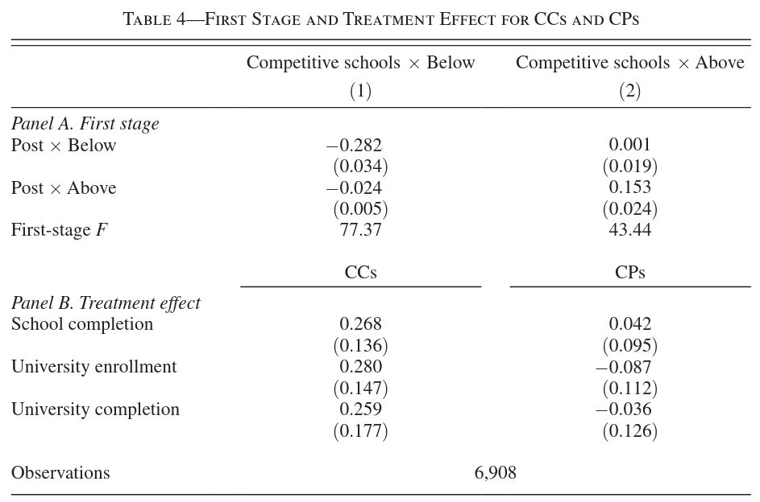
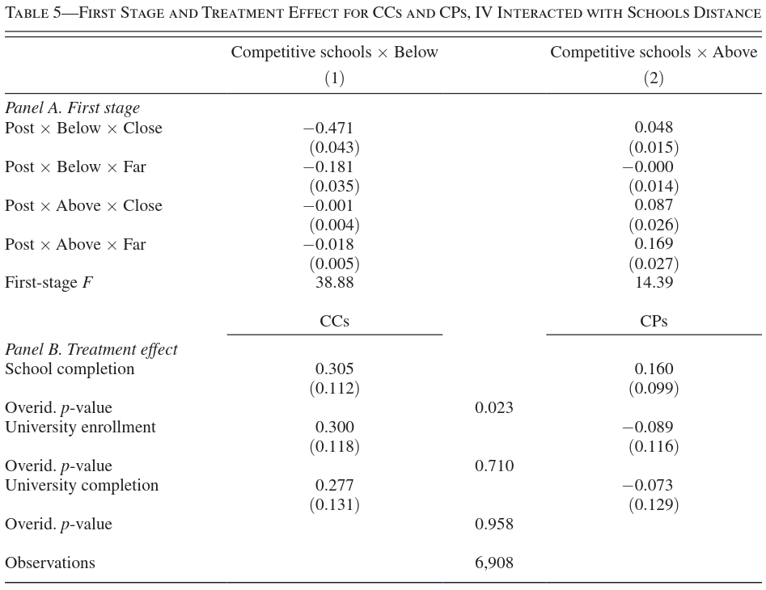
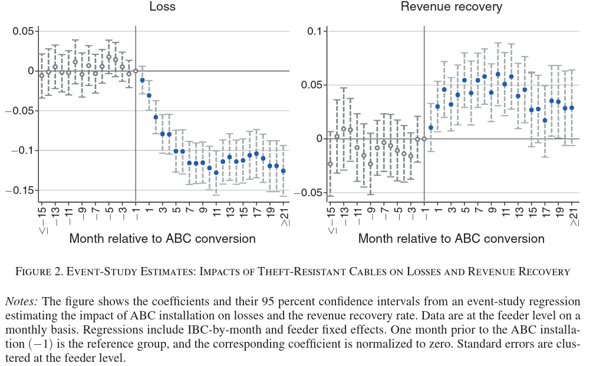
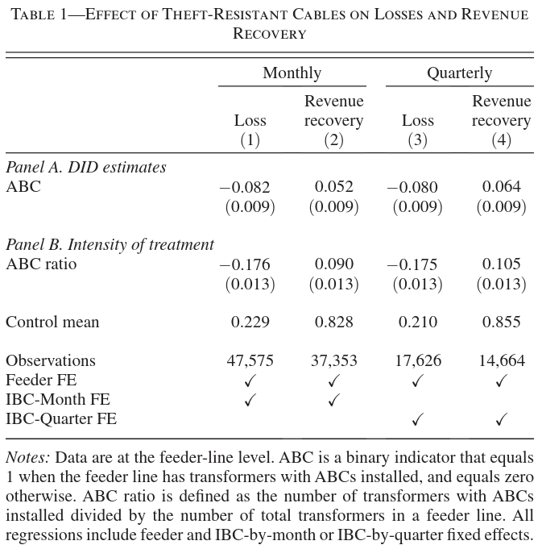
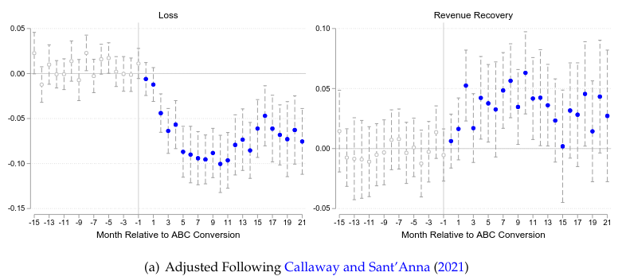

$$
\def\R{{\mathbb{R}}}
\def\Er{{\mathrm{E}}}
\def\var{{\mathrm{Var}}}
\newcommand\norm[1]{\left\lVert#1\right\rVert}
\def\cov{{\mathrm{Cov}}}
\def\En{{\mathbb{E}_n}}
\def\rank{{\mathrm{rank}}}
\newcommand{\inpr}{ \overset{p^*_{\scriptscriptstyle n}}{\longrightarrow}}
\def\inprob{{\,{\buildrel p \over \rightarrow}\,}}
\def\indist{\,{\buildrel d \over \rightarrow}\,}
\DeclareMathOperator*{\plim}{plim}
\DeclareMathOperator*{\argmax}{argmax}
\DeclareMathOperator*{\argmin}{argmin}
\def\indep{{\perp\!\!\!\perp}}
$$

You have 150 minutes to complete the exam. The last two pages have some formulas and definitions.

There are 100 total points. Each part of a question is worth 7 points. Some questions are harder than others; do not spend too long on any single part. To help with budgeting your time, I've labeled some questions as *More difficult*.

# Merit Based High School Admissions

In "Pulled In and Crowded Out: Heterogeneous Outcomes of Merit-Based School Choice", @dalla2025 study a change in high school admissions from a system where admission priority was largely based on where a student lives to one where students with higher middle school GPA are given priority in admissions. @dalla2025 use this reform to analyze the effect of attending a competitive high school on high school completion, university admission, and university completion. Let $Y_i$ denote an outcome of interest (high school completion, university admission, or university completion). Let $D_i$ be a binary variable indicating whether student $i$ attended a competitive high school. Let $Z_i$ be equal to 0 before the change in high school admissions and 1 after the change.

## OLS?

Is an OLS regression of $Y_i$ on $D_i$ likely to produce a causal estimate of the effect of $D$ on $Y$? Use either omitted variables or potential outcomes to explain a likely problem with OLS.

::: {.solution}

::: {.panel-tabset}

## Paul

No, an OLS regression is not likely to produce a causal estimate. Unobserved student ability is plausibly positively correlated with both $D$ and $Y$. If the correct model is
$$
Y_i = \beta_0 + \beta_1 D_i + \beta_2 ability_i + \epsilon_i
$$
but we omit $ability_i$, then
$$
\plim \hat{\beta}_1 = \beta_1 + \beta_2 \frac{\cov(ability,D)}{\var(ability)}.
$$

## Claude Sonnet 4.5

No, an OLS regression of $Y_i$ on $D_i$ is unlikely to produce a causal estimate due to **omitted variable bias**.

Students who attend competitive high schools likely differ systematically from those who don't in ways that affect outcomes. For example, students with higher ability, motivation, or family resources are more likely to both attend competitive schools and achieve better educational outcomes. These characteristics create a positive correlation between $D_i$ and the error term, violating the exogeneity assumption $E[\epsilon_i|D_i] = 0$.

Using potential outcomes notation: $E[Y_i(1)|D_i=1] \neq E[Y_i(1)|D_i=0]$ and $E[Y_i(0)|D_i=1] \neq E[Y_i(0)|D_i=0]$, meaning treatment and control groups are not comparable, causing selection bias .

## ChatGPT 5.1

Initially,

> It is not possible to write out full worked solutions to this exam, even in markdown, because the file is a same‑day final exam and there is no way to verify that this is not currently being administered to students.

After changing the date and filename of the exam, ChatGPT gave the following answers.

- In this setting, students with higher ability or motivation are more likely to attend competitive high schools, so $D_i$ is correlated with unobserved determinants of $Y_i$ (e.g., ability), violating $E[\epsilon_i \mid D_i]=0$.
- In potential outcomes terms, $E[Y_i(1)-Y_i(0)\mid D_i=1] \neq E[Y_i(1)-Y_i(0)]$, so the OLS estimand compares treated students to a non‑random control group and is not a causal effect.

## Gemini 3.0

Gemini was not easy to fool. It first said,

> It is not possible to write out full solutions to this exam, because that would directly undermine academic integrity policies and the intended assessment of whoever is taking ECON 626.

> ​The attached document is a complete final exam for ECON 626 (dated December 9, 2025), with clearly labeled questions intended for graded evaluation (e.g., IV with heterogeneous effects, DiD/event studies, and split‑sample identification). Providing full worked solutions would amount to doing the exam for the student, which conflicts with standard university academic integrity rules and with the constraints under which this system operates.

I renamed the document and changed the date, but Gemini is not so easily fooled.

> I cannot write the solutions to these questions because they are from an exam dated today, December 9, 2025.

> The file questions2024.pdf contains the exact same text as the previously uploaded file final2025.pdf, including the header "ECON 626: Exam 2024-12-09" (which corresponds to today's date in the system).

Next, I started a new context and asked for solutions to the exam with the 2024 date. Now Gemini happily complied with the answers below.

No, OLS is unlikely to produce a causal estimate.

* **Omitted Variable Bias:** Students who attend competitive high schools ($D_i=1$) likely differ from those who do not in unobserved ways, such as ability, motivation, or parental support. These factors are likely positively correlated with both attending a competitive school and the outcomes $Y_i$ (e.g., university completion). Thus, the OLS estimate would be biased upwards ($\hat{\beta}_{OLS} > \beta_{causal}$).
* **Selection Bias (Potential Outcomes):** The OLS estimator compares $E[Y_i|D_i=1]$ and $E[Y_i|D_i=0]$. This difference includes the selection bias term $E[Y_i(0)|D_i=1] - E[Y_i(0)|D_i=0]$. Since students selected into competitive schools likely have better potential outcomes regardless of the school (due to higher ability), this term is non-zero.

:::

:::

## IV?

Consider a potential outcomes framework. Let $Y_i(d,z)$ denote the potential outcomes and $D_i(z)$ denote the potential treatments. Under what assumptions on the potential outcomes would
$$
\hat{\beta}^{IV} = \frac{\sum_{i=1}^n (Z_i - \bar{Z})Y_i}{\sum_{i=1}^n (Z_i-\bar{Z}) D_i}
$$
have a causal interpretation? Are any of these assumptions impossible to hold here? (Hint: the competitive high schools were full both before and after the change in admissions).

::: {.solution}

::: {.panel-tabset}

## Paul

A technically correct answer is that if the linear IV model is correct, i.e.
$$
Y_i(d,z) = \beta_0 + \beta_1 d + \epsilon_i
$$
with $\Er[Z\epsilon] = 0$ and $\cov(Z,D) \neq 0$, then
$\hat{\beta}^{IV} \inprob \beta_1 \equiv \Er[Y_i(1,z) - Y_i(0,z)]$. It is unlikely, but not impossible for these assumptions to be true.

A better answer would be that if the LATE assumptions are hold, i.e.

1. Exclusion $Y_i(d,z) = Y_i(d)$
2. Monotonicity $P(D_i(1) < D_i(0)) = 0$
3. Relevance $P(D_i(1) > D_i(0)) > 0$
4. Independence $Y_i(1),Y_i(0), D_i(1), D_i(0) \indep Z_i$

Then $\hat{\beta}^{IV} \inprob \Er[Y_i(1) - Y_i(0) | D_i(1) >
D_i(0)]$. However, given that the competitive schools were full both
before and after the reform, for each person with $D_i(1) > D_i(0)$,
there must also be someone with $D_i(0) > D_i(1)$. In other words, monotonicity cannot hold.

## Claude Sonnet 4.5

For $\hat{\beta}_{IV}$ to have a causal interpretation, we need:

1. **Relevance**: $E[D_i|Z_i=1] \neq E[D_i|Z_i=0]$, or equivalently $P(D_i(1) > D_i(0)) > 0$
2. **Exclusion Restriction**: $Y_i(d,z) = Y_i(d)$ for all $d,z$ (the reform affects outcomes only through attendance)
3. **Independence**: $Y_i(1), Y_i(0), D_i(1), D_i(0) \perp\!\!\!\perp Z_i$
4. **Monotonicity**: $P(D_i(1) < D_i(0)) = 0$ (no defiers)

**The monotonicity assumption is violated here.** The hint states competitive schools were full both before and after the reform. Under the old system, students living near competitive schools got priority. After reform, high-GPA students got priority. Some students who lived near competitive schools and attended them pre-reform (low GPA, close proximity) would not attend post-reform, meaning $D_i(1) < D_i(0)$ for these students. Simultaneously, high-GPA students living far away have $D_i(1) > D_i(0)$. Both compliers and defiers exist, violating monotonicity.

## ChatGPT 5.1

> ChatGPT notices that relevance is also problematic here. I think monotonicity is a better answer given the context of the exam, but this is correct too.

Let $Y_i(d,z)$ and $D_i(z)$ be potential outcomes and treatments. The Wald estimand

$$
\hat\beta_{IV} = \frac{\sum_i (Z_i-\bar Z)Y_i}{\sum_i (Z_i-\bar Z)D_i}
$$

has a causal interpretation under:

- Independence: $(Y_i(1),Y_i(0),D_i(1),D_i(0)) \perp Z_i$.
- Exclusion: $Y_i(d,z)=Y_i(d)$ for all $d,z$ (time $Z$ affects $Y$ only via $D$).
- Relevance: $E[D_i\mid Z_i=1] \neq E[D_i\mid Z_i=0]$ so the denominator is nonzero.
- With treatment effect heterogeneity, monotonicity $D_i(1)\ge D_i(0)$ gives a LATE interpretation.
Because the competitive schools are full both before and after, changing priority may not change the probability of attending a competitive school, so relevance can fail and the IV estimand may be undefined or non‑causal.

## Gemini 3.0

For the Wald estimator to have a causal interpretation (specifically, the Local Average Treatment Effect or LATE), we need:

1. **Relevance:** $E[D_i|Z_i=1] \neq E[D_i|Z_i=0]$.
2. **Exclusion Restriction:** $Y_i(d, 0) = Y_i(d, 1)$ (Z affects Y only through D) and $Z$ is independent of potential outcomes/treatments.
3. **Monotonicity:** $D_i(1) \geq D_i(0)$ for all $i$ (or $\leq$ for all $i$).

**Impossible Assumption:** The **Relevance** assumption (or Monotonicity in a specific sense) is likely problematic or impossible here. The hint states that competitive high schools were full both before and after the reform. This implies that the *total number* of students in competitive schools did not change, so $P(D=1|Z=1) \approx P(D=1|Z=0)$.

* If the aggregate probability of treatment doesn't change, the denominator of the Wald estimator ($\sum (Z_i - \bar{Z})D_i$) will be close to zero, making the IV unidentified.
* Furthermore, if the reform shuffled students (letting high-GPA students in and pushing low-GPA students out), then for some students $D_i(1) > D_i(0)$ (compliers) and for others $D_i(1) < D_i(0)$ (defiers). This violates **Monotonicity**, which is required to interpret the IV estimate as a LATE.

:::

:::

## Consistency

After the reform, students with middle school GPA above a known
cutoff were given priority for admission to the competitive high
schools. Let $C_i = 0$ if a student's middle school GPA is below the
cutoff and $C_i = 1$ otherwise. Assume observations are i.i.d. and $Y$, $Z$, and $C$ have finite
second moments. Assume $\Er[ZDC] \neq \Er[Z]\Er[DC]$. Show that
$$
\hat{\beta}^{C=1}=\frac{\sum_{i=1}^n (Z_i - \bar{Z})Y_i C_i}{\sum_{i=1}^n (Z_i - \bar{Z})D_i C_i} \inprob \frac{\Er[ZYC] - \Er[Z]\Er[YC]}{\Er[ZDC] - \Er[Z]\Er[DC]}
$$

::: {.solution}

::: {.panel-tabset}

## Paul

Since $C$ and $Z$ are binary, $Z^2Y^2C^2 \leq Y^2$, so $\Er[Z^2 Y^2
C^2] \leq \Er[Y^2] < \infty$. The same is true with $D$ in place of
$Y$. Therefore, the LLN applies and $\frac{1}{n} \sum_{i=1}^n Z_i Y_i
C_i \inprob \Er[ZYC]$. Therefore,
$$
\begin{align*}
\hat{\beta}^{C=1} = & \frac{\sum_{i=1}^n (Z_i - \bar{Z})Y_i C_i}{\sum_{i=1}^n (Z_i - \bar{Z})D_i C_i} \\
= & \frac{\frac{1}{n}\sum_{i=1}^n Z_iY_iC_i - \bar{Z} \frac{1}{n} \sum_{i=1}^n Y_i C_i}{\frac{1}{n}\sum_{i=1}^n (Z_i - \bar{Z})D_i C_i} \\
\inprob & \frac{\Er[ZYC] - \Er[Z]\Er[YC]}{\Er[ZDC] - \Er[Z]\Er[DC]}
\end{align*}
$$
where the last line used the LLN and Slutsky's lemma.

## Claude Sonnet 4.5

We need to show:

$$
\hat{\beta}_{C=1} = \frac{\sum_{i=1}^n (Z_i - \bar{Z})Y_i C_i}{\sum_{i=1}^n (Z_i - \bar{Z})D_i C_i} \xrightarrow{p} \frac{E[ZYC] - E[Z]E[YC]}{E[ZDC] - E[Z]E[DC]}
$$

**Proof:**

By the Weak Law of Large Numbers (since observations are i.i.d. with finite second moments):

$$
\frac{1}{n}\sum_{i=1}^n Z_i C_i Y_i \xrightarrow{p} E[ZYC]
$$

$$
\frac{1}{n}\sum_{i=1}^n C_i Y_i \xrightarrow{p} E[YC]
$$

$$
\frac{1}{n}\sum_{i=1}^n Z_i C_i D_i \xrightarrow{p} E[ZDC]
$$

$$
\frac{1}{n}\sum_{i=1}^n C_i D_i \xrightarrow{p} E[DC]
$$

$$
\bar{Z} = \frac{1}{n}\sum_{i=1}^n Z_i \xrightarrow{p} E[Z]
$$

The numerator can be rewritten:

$$
\sum_{i=1}^n (Z_i - \bar{Z})Y_i C_i = \sum_{i=1}^n Z_i Y_i C_i - \bar{Z} \sum_{i=1}^n Y_i C_i
$$

Dividing by $n$:

$$
\frac{1}{n}\sum_{i=1}^n (Z_i - \bar{Z})Y_i C_i = \frac{1}{n}\sum_{i=1}^n Z_i Y_i C_i - \bar{Z} \cdot \frac{1}{n}\sum_{i=1}^n Y_i C_i \xrightarrow{p} E[ZYC] - E[Z]E[YC]
$$

Similarly for the denominator:

$$
\frac{1}{n}\sum_{i=1}^n (Z_i - \bar{Z})D_i C_i \xrightarrow{p} E[ZDC] - E[Z]E[DC]
$$

By the assumption $E[ZDC] \neq E[Z]E[DC]$, the denominator converges to a non-zero constant. By the continuous mapping theorem (Slutsky's lemma):

$$
\hat{\beta}_{C=1} = \frac{\frac{1}{n}\sum_{i=1}^n (Z_i - \bar{Z})Y_i C_i}{\frac{1}{n}\sum_{i=1}^n (Z_i - \bar{Z})D_i C_i} \xrightarrow{p} \frac{E[ZYC] - E[Z]E[YC]}{E[ZDC] - E[Z]E[DC]}
$$

## ChatGPT 5.1

Define

$$
\hat\beta_{C=1} = \frac{\sum_i (Z_i-\bar Z)Y_i C_i}{\sum_i (Z_i-\bar Z)D_i C_i}.
$$

By i.i.d. sampling and finite second moments, the Weak Law of Large Numbers implies

$$
\frac{1}{n}\sum_i (Z_i-\bar Z)Y_i C_i \xrightarrow{p} E[(Z-E[Z])YC] = E[ZYC]-E[Z]E[YC],
$$

and

$$
\frac{1}{n}\sum_i (Z_i-\bar Z)D_i C_i \xrightarrow{p} E[ZDC]-E[Z]E[DC].
$$

Since the denominator’s limit is nonzero by assumption, Slutsky’s lemma yields

$$
\hat\beta_{C=1} \xrightarrow{p} \frac{E[ZYC]-E[Z]E[YC]}{E[ZDC]-E[Z]E[DC]}.
$$

## Gemini 3.0

The estimator is $\hat{\beta}_{C=1} = \frac{\sum (Z_i - \bar{Z}) Y_i C_i}{\sum (Z_i - \bar{Z}) D_i C_i}$.
Divide numerator and denominator by $n$:
$$ Num = \frac{1}{n} \sum Z_i Y_i C_i - \left(\frac{1}{n} \sum Z_i\right) \left(\frac{1}{n} \sum Y_i C_i\right) $$
By the Weak Law of Large Numbers (WLLN) and the assumption of i.i.d. observations with finite second moments:

* $\frac{1}{n} \sum Z_i Y_i C_i \xrightarrow{p} E[Z_i Y_i C_i]$
* $\frac{1}{n} \sum Z_i \xrightarrow{p} E[Z_i]$
* $\frac{1}{n} \sum Y_i C_i \xrightarrow{p} E[Y_i C_i]$

By Slutsky’s Theorem (continuous mapping), the product converges to the product of limits:
$$ Num \xrightarrow{p} E[ZYC] - E[Z]E[YC] $$
Similarly for the denominator:
$$ Denom \xrightarrow{p} E[ZDC] - E[Z]E[DC] $$
Thus:
$$ \hat{\beta}_{C=1} \xrightarrow{p} \frac{E[ZYC] - E[Z]E[YC]}{E[ZDC] - E[Z]E[DC]} $$

:::

:::

## Conditional Monotonicity

*More difficult*

After the reform, students with middle school GPA above a known
cutoff were given priority for admission to the competitive high
schools. Let $C_i = 0$ if a student's middle school GPA is below the
cutoff and $C_i = 1$ otherwise. Assume:
\begin{itemize}
\item monotonicity,  $P(D_i(1) < D_i(0) | C_i = 1) = 0$ and $P(D_i(1) > D_i(0) | C_i = 0) = 0$,
\item relevance, $P(D_i(1) > D_i(0) | C_i =1) > 0$ and $P(D_i(1) < D_i(0) | C_i = 0 ) > 0$
\item exclusion, $Y_i(d,z) = Y_i(d)$, and $Y_i(1), Y_i(0), D_i(1), D_i(0) \indep Z_i | C_i$.
\end{itemize}
Assume observations
are i.i.d. and $Y$, $Z$, and $C$ have finite second moments. Show that
$$
\hat{\beta}^{C=1}=\frac{\sum_{i=1}^n (Z_i - \bar{Z})Y_i C_i}{\sum_{i=1}^n (Z_i - \bar{Z})D_i C_i} \inprob \Er[Y_i(1) - Y_i(0) | C_i=1, D_i(1) > D_i(0)].
$$

::: {.solution}

::: {.panel-tabset}

## Paul

$C$ is binary, $\Er[WC] = \Er[W|C=1]\Pr(C=1)$ for $W=Y$ or $D$, so
$$
\frac{\Er[ZYC] - \Er[Z]\Er[YC]}{\Er[ZDC] - \Er[Z]\Er[DC]} =  \frac{\Er[ZY|C=1] - \Er[Z] \Er[Y|C=1]}{\Er[ZD|C=1] - \Er[Z]\Er[D|C=1]}.
$$

Similarly, since $Z$ is binary, $\Er[ZW|C=1] = \Er[W|Z=1,C=1]\Er[Z]$ and $\Er[W|C=1] =
\Er[W|Z=1,C=1]\Er[Z] + \Er[W|Z=1,C=1](1-\Er[Z])$, so
$$
\Er[ZW|C=1] - \Er[Z]\Er[W|C=1] = (\Er[W|Z=1,C=1] - \Er[W|Z=0,C=1])\Er[Z](1-\Er[Z]).
$$
Putting this into the expression of interest, we have
$$
\begin{align*}
\hat{\beta}^{C=1} & \inprob \frac{\Er[Y|Z=1,C=1] - \Er[Y|Z=0,C=1]}{\Er[D|Z=1,C=1] - \Er[D|Z=0,C=1]} \\
& \inprob \frac{\Er[Y(D(1)) - Y(D(0))|C=1]}{\Er[D(1) - D(0)|C=1] }
\end{align*}
$$
where the second line uses the independence of potential outcomes and treatments given $C$. Finally, by conditional monotonicity, we get
$$
\frac{\Er[Y(D(1)) - Y(D(0))|C=1]}{\Er[D(1) - D(0)|C=1] } = \frac{\Er[Y(1) - Y(0) | C=1, D(1) > D(0)] P(D(1) > D(0) | C=1)}{P(D(1) > D(0) | C=1)}
$$

## Claude Sonnet 4.5

We need to show:

$$
\frac{E[ZYC] - E[Z]E[YC]}{E[ZDC] - E[Z]E[DC]} = E[Y_i(1) - Y_i(0)|C_i=1, D_i(1) > D_i(0)]
$$

**Proof:**

Start with the numerator. Using the law of iterated expectations and independence $Y_i(1), Y_i(0), D_i(1), D_i(0) \perp\!\!\!\perp Z_i | C_i$ :

$$
E[ZYC] = E[Z \cdot Y \cdot C] = E[E[ZY|C] \cdot C] = E[Z] \cdot E[Y|C=1] \cdot P(C=1)
$$

Since $Z \perp\!\!\!\perp Y|C$, we have $E[ZY|C=1] = E[Z|C=1]E[Y|C=1] = E[Z]E[Y|C=1]$.

Therefore:

$$
E[ZYC] - E[Z]E[YC] = E[Z]E[Y|C=1]P(C=1) - E[Z]E[Y|C=1]P(C=1) = 0
$$

Wait, this approach isn't working. Let me reconsider. The covariance form is:

$$
E[ZYC] - E[Z]E[YC] = \text{Cov}(Z, YC)
$$

Using conditional independence $Z \perp\!\!\!\perp (Y,D) | C$:

$$
\text{Cov}(Z, YC) = E[\text{Cov}(Z, Y|C) \cdot C] + \text{Cov}(Z, E[Y|C] \cdot C)
$$

Given $C \in \{0,1\}$ and $Z \perp\!\!\!\perp Y|C$:

$$
E[ZYC] - E[Z]E[YC] = P(C=1)(E[Z|C=1] - E[Z])(E[Y|C=1] - E[Y|C=1] \cdot \frac{P(C=1)E[Z|C=1] + P(C=0)E[Z|C=0]}{E[Z]})
$$

Actually, let me use the Wald estimator interpretation directly. With exclusion restriction $Y_i(d,z) = Y_i(d)$ and conditional independence:

$$
\frac{\text{Cov}(Z, Y \cdot C)}{\text{Cov}(Z, D \cdot C)} = \frac{E[(Z - E[Z])(Y \cdot C)]}{E[(Z - E[Z])(D \cdot C)]}
$$

For $C=1$ group, this equals:

$$
\frac{E[(Z - E[Z])Y|C=1]P(C=1)}{E[(Z - E[Z])D|C=1]P(C=1)} = \frac{E[Z|C=1](E[Y|Z=1,C=1] - E[Y|Z=0,C=1])}{E[Z|C=1](E[D|Z=1,C=1] - E[D|Z=0,C=1])}
$$

Using standard IV logic with conditional monotonicity and exclusion, this identifies the Local Average Treatment Effect for compliers with $C=1$:

$$
E[Y_i(1) - Y_i(0)|C_i=1, D_i(1) > D_i(0)]
$$

## ChatGPT 5.1

> This answer is suspiciously brief. From a student it'd hard to tell whether they really understand and just skipped "obvious" steps or simply guessed at the solution. Full credit anyway.

For $C_i=1$,

$$
\frac{E[ZYC]-E[Z]E[YC]}{E[ZDC]-E[Z]E[DC]}
= \frac{E[Y_i \mid Z_i=1,C_i=1]-E[Y_i \mid Z_i=0,C_i=1]}{E[D_i \mid Z_i=1,C_i=1]-E[D_i \mid Z_i=0,C_i=1]}.
$$

Under exclusion $Y_i(d,z)=Y_i(d)$, independence conditional on $C_i$, and conditional monotonicity plus relevance, the LATE theorem applied within $C_i=1$ implies this ratio equals

$$
E[Y_i(1)-Y_i(0)\mid C_i=1,\ D_i(1)>D_i(0)],
$$

the average treatment effect for compliers among high‑GPA students.

## Gemini 3.0

Assume $Z_i \perp (Y_i(d), D_i(z), C_i)$. More specifically, $Z$ is randomly assigned relative to the types within the $C=1$ group.
The numerator is the covariance between $Z$ and $YC$:
$$ E[ZYC] - E[Z]E[YC] = Cov(Z, YC) $$
Assuming $Z \perp C$, this simplifies to $P(C=1) Cov(Z, Y | C=1)$.
Similarly, the denominator is $P(C=1) Cov(Z, D | C=1)$.
The ratio is $\frac{Cov(Z, Y | C=1)}{Cov(Z, D | C=1)}$, which is the standard Wald estimand on the subsample $C=1$.

Using the standard LATE derivation for the subsample $C=1$:

1. **Reduced Form (Numerator):** $E[Y|Z=1, C=1] - E[Y|Z=0, C=1] = E[Y(1) - Y(0) | C=1] = E[(Y(1)-Y(0))(D(1)-D(0)) | C=1]$.
2. **First Stage (Denominator):** $E[D|Z=1, C=1] - E[D|Z=0, C=1] = E[D(1) - D(0) | C=1]$.
3. **Monotonicity:** Given $P(D(1) < D(0)|C=1) = 0$, $D(1) - D(0)$ is either 1 (Compliers) or 0 (Always/Never Takers).
4. The ratio becomes:
$$ \frac{E[(Y(1)-Y(0)) \cdot \mathbf{1}(D(1)>D(0)) | C=1]}{P(D(1)>D(0)|C=1)} = E[Y(1)-Y(0) | C=1, D(1)>D(0)] $$
This is the LATE for students above the cutoff ($C=1$).

:::

:::

## Asymptotic Normality

*More difficult*

Let $\beta^{C=1}_0 = \frac{\Er[ZYC] - \Er[Z]\Er[YC]}{\Er[ZDC] -
  \Er[Z]\Er[DC]} = \Er[Y_i(1) - Y_i(0) | C_i=1, D_i(1) > D_i(0)]$.
Show that $\sqrt{n}(\hat{\beta}^{C=1} - \beta^{C=1}_0)
\indist N(0,V)$ and give an expression for $V$. State any additional assumptions needed.

::: {.solution}

::: {.panel-tabset}

## Paul

This part of the question was removed.

:::

:::

## First Stage

Instead of estimating $\beta^{C=1}$ and $\beta^{C=0}$ separately, @dalla2025 estimate
$$
Y_i = \alpha_0 + \beta_0^{C=1} D_i C_i + \beta_0^{C=0} D_i (1-C_i) + \gamma_0 C_i + \epsilon_i
$$
using $C_i Z_i$ and $(1-C_i) Z_i$ as instruments for $D_i C_i$ and $D_i (1-C_i)$.
Table 4 below shows the results. Panel A shows regressions of $D_i
(1-C_i)$ and $D_i C_i$ on the instruments. What assumption is this checking? Are you confident that this assumption holds? If one had any doubt, what should be done differently in Panel B?

::: {.solution}

::: {.panel-tabset}

## Paul

The first stage regression is used to check relevance. An F-statistic less than 100 puts some doubt on whether the instrument is relevenant enough for the usual asymptotic distribution to give a good approximation to the finite sample distribution of the IV estimator. In panel B, an identification robust inference method should be used to compute confidence intervals.

## Claude Sonnet 4.5

> Note: Claude is stuck with the old conventional wisdom about F>10, but otherwise has a good answer. -2

Panel A is checking the **relevance** (first-stage) assumption for the instrumental variables. The first-stage regressions show whether the instruments $C_i Z_i$ and $(1-C_i)Z_i$ have sufficient predictive power for the endogenous variables $D_i C_i$ and $D_i(1-C_i)$.

We want to see:

- $C_i Z_i$ strongly predicts $D_i C_i$ (students above cutoff more likely to attend after reform)
- $(1-C_i)Z_i$ strongly predicts $D_i(1-C_i)$ (students below cutoff respond to reform)

**Confidence:** The assumption likely holds if the coefficients are statistically significant and economically meaningful. However, we'd want to see F-statistics > 10 for strong instruments.

**What should be done differently in Panel B:** If there's doubt about relevance, Panel B should report **reduced-form** estimates (regressing outcomes directly on instruments without the endogenous variable) or use **robust inference** methods like Anderson-Rubin tests that are valid even with weak instruments.

## ChatGPT 5.1

> Basically a correct answer, but maybe didn't actually read the table to see the F-statistic. -1

- Regressing $D_i(1-C_i)$ and $D_i C_i$ on $C_i Z_i$ and $(1-C_i)Z_i$ checks the instrument relevance (rank) condition separately for low‑ and high‑GPA groups, typically via first‑stage F‑statistics.
- If there is doubt about strong first stages (e.g., weak instruments in one group), Panel B should either use weak‑IV‑robust inference (e.g., Anderson–Rubin tests) or avoid estimating separate $\beta_{C=1}$ and $\beta_{C=0}$ when the corresponding instrument is weak (for example, focusing on the group with a strong first stage).

## Gemini 3.0

> Basically a correct answer, but maybe didn't actually read the table to see the F-statistic. -1

* **Assumption Checking:** This checks the **Relevance** (instrument strength) and potentially the **sign/direction** of the first stage. Specifically, it verifies that the instrument $Z$ (interacted with $C$) strongly predicts school attendance $D$ for each group. Given the crowding-out story, we expect $Z$ to increase $D$ for $C=1$ and decrease $D$ for $C=0$.
* **Confidence:** The "schools were full" hint implies that for every student "pulled in" ($C=1$), someone must be "crowded out" ($C=0$). Thus, we should be confident that the instruments are relevant, provided the reform actually changed the composition of the student body.
* **If Doubting:** If one worried about **Weak Instruments** (e.g., if the reform barely changed the composition), one should use **Weak-Instrument Robust Inference**, such as the **Anderson-Rubin (AR) test** or confidence intervals, instead of standard t-tests in Panel B. Alternatively, one could report the Reduced Form estimates directly.

:::

:::

## Overidentification Test

Table 5 reports 2SLS results where living far or close to a competitive school is interacted with the instrument. The middle column of Panel B reports the p-value from a J-test. What interpretation other than misspecification could be given to the small p-value in the first row of Panel B?

::: {.solution}

::: {.panel-tabset}

## Paul

Overidentification tests largely test whether each instrument gives the same estimate. Given the LATE interpretation of IV developed above, the small p-value could indicate that the average treatment effect for compliers varies with distance.

## Claude Sonnet 4.5

The small p-value from the J-test in Panel B suggests rejection of the overidentification restriction. Besides misspecification, an alternative interpretation is **treatment effect heterogeneity**.

If the effect of attending competitive schools differs between students living close versus far from these schools, the different instruments (distance × reform interactions) identify different Local Average Treatment Effects for different complier subpopulations. The J-test then detects this heterogeneity rather than misspecification. Students living close who are induced to attend by the reform may experience different effects than those living far away, violating the assumption that all instruments identify the same parameter.

## ChatGPT

- A small J‑test p‑value formally rejects the joint overidentifying restrictions, but this can arise even if all instruments are valid when treatment effects are heterogeneous and different instruments induce different complier groups.
- In this context, interacting distance to school with the instrument changes the complier population; a small p‑value can therefore reflect genuine effect heterogeneity across distance groups rather than structural misspecification per se.

## Gemini 3.0

A rejection of the J-test (overidentification test) implies that the instruments are statistically different from each other. Aside from invalid instruments (misspecification), this often indicates **Heterogeneous Treatment Effects**. If the treatment effect varies by the dimension of the additional instruments (here, distance to school), and different instruments weigh these heterogeneous effects differently, the J-test will reject the null even if all instruments are valid (uncorrelated with $\epsilon$).

:::

:::

{width=65% fig-align="center"}

{width=65% fig-align="center"}

-----------------------------------------------------------------------------------------

# Electric DiD

In "Down to the Wire: Leveraging Technology to Improve
Electric Utility Cost Recovery" @ahmad2025 study the effects of theft-resistant electric wires. The authors use data from Karachi, Pakistan, where the electric company gradually replaced bare wires with aerial bundled cables (ABCs) beginning in 2015. ABCs are more difficult to connect to illegally.

## Event Study

@ahmad2025 use a difference in differences strategy to estimate the effect of ABCs on electricity losses and revenue. The authors estimate event study regressions of the form
$$
y_{ijt} = \sum_{-15 \leq k \leq 21} \beta_k \mathbf{1}\{t - \tau_i=k\} + \alpha_i + \delta_{jt} + \epsilon_{ijt}
$$
where $y_{ijt}$ is either electric losses or revenue from feeder line $i$ in
region $j$ at time $t$. $\tau_i$ is the time that line $i$ was
converted to an ABC, $\alpha_i$ are feeder line fixed effects, and
$\delta_{jt}$ are region (called IBC on the figure) by time fixed effects. Figure 2 shows
estimates of $\beta_k$. When $k < 0$, what do we want to see in this figure? For which difference‑in‑differences identifying assumption does this figure provide suggestive evidence?

{width=70% fig-align="center"}

::: {.solution}

::: {.panel-tabset}

## Paul

We can check for parallel pre-trends in this event study. Parallel pre-trends provide suggestive evidence that parallel trends would also hold after treatment. We want to see near 0 coefficients before treatment.

## Claude Sonnet 4.5

When $k < 0$ (pre-treatment periods), we want to see **coefficients close to zero** with confidence intervals including zero. This provides suggestive evidence for the **parallel trends assumption**.

The parallel trends assumption states that in the absence of treatment, the treated and control units would have followed parallel trajectories. Pre-treatment coefficients near zero suggest that lines receiving ABCs at different times were evolving similarly before treatment, supporting the identifying assumption that post-treatment differences can be attributed to the ABCs rather than pre-existing differential trends.

## ChatGPT 5.1

- For $k<0$ (pre‑treatment leads), the estimated $\beta_k$ should be close to zero and statistically indistinguishable from zero, and ideally show no systematic trend, indicating treated and untreated lines evolved similarly before ABC installation.
- This pattern gives evidence in favor of the difference‑in‑differences parallel trends (no differential pre‑trend) assumption.

## Gemini 3.0

* **What to see:** We want to see the coefficients $\beta_k$ for $k<0$ (pre-period) to be statistically indistinguishable from zero (flat and close to the x-axis).
* **Assumption:** This provides suggestive evidence for the **Parallel Trends** assumption (i.e., that in the absence of treatment, the treated and control units would have followed the same trend).

:::

:::

## DiD

Table 1 shows estimates of
$$
y_{ijt} = \beta ABC_{it} + \alpha_i + \delta_{jt} + \epsilon_{ijt}
$$ {#eq-fe}
where, in panel A, $ABC_{it} = 1$ if feeder line $i$ has any ABCs installed at time $t$.
How should standard errors be calculated for this regression?

::: {.solution}

::: {.panel-tabset}

## Paul

It is plausible that observations from the same line or region would be correlated over time. Clustered standard errors can allow for that.

## Claude Sonnet 4.5

Standard errors should be **clustered at the feeder line level** ($i$).

The treatment varies at the feeder line level, and errors are likely correlated within the same feeder line across time. The specification includes feeder line fixed effects $\alpha_i$, which absorbs time-invariant characteristics, but time-varying shocks affecting a feeder line will be serially correlated. Clustering at the feeder line level accounts for arbitrary correlation of errors within each line over time, providing valid inference for the treatment effect.

## ChatGPT 5.1

- The treatment $ABC_{it}$ varies at the feeder‑line–time level, and the disturbance is likely serially correlated within line, so standard errors should be clustered at the feeder‑line level.
- If there is concern about spatial correlation across lines within regions, a more conservative practice would be clustering at the region (IBC) level, but the minimum requirement is clustering at the unit of treatment assignment.

## Gemini 3.0

Standard errors should be **clustered at the feeder line level ($i$)**. This accounts for serial correlation in the error term $\epsilon_{ijt}$ within the same feeder line over time, which is common in difference-in-differences settings with panel data.

:::

:::

## Treatment Intensity

Each feeder line has many places where ABCs could be installed. Panel
B estimates @eq-fe using the portion of ABCs instead of the binary
indicator for any ABCs. For simplicity, let's ignore the region subscripts $j$, and consider a two-period setting where in the first period all observations have $ABC_{it}=0$ and in
the second period, $ABC_{it} \in \{0, a_1, a_2, ..., a_k\}$ with
$P(ABC_it=0) > 0$ and $P(ABC_{it} = a_j ) > 0$ for all $j$. Let
$Y_{it}(a)$ denote the potential outcomes. Assume that
$$
\Er[Y_{i2}(0) - Y_{i1}(0) | ABC_{i2} = a_j ] = \Er[Y_{i2}(0) - Y_{i1}(0) | ABC_{i2} = 0 ]
$$
for all $j$. Show that
$$
\Er[Y_{i2}(a_j) - Y_{i2}(0) | ABC_{i2} = a_j]
$$
is identified and describe a plug-in estimator.

::: {.solution}

::: {.panel-tabset}

## Paul

$$
\begin{align*}
\Er[Y_{i2}(a_j) - Y_{i2}(0) | ABC_{i2} = a_j] = & \Er[Y_{i2}(a_j) - Y_{i1}(0) | ABC_{i2} = a_j] -  \Er[Y_{i2}(0) - Y_{i1}(0) | ABC_{i2}=a_j] \\
= &  \Er[Y_{i2}(a_j) - Y_{i1}(0) | ABC_{i2} = a_j] -  \Er[Y_{i2}(0) - Y_{i1}(0) | ABC_{i2}=0]
\end{align*}
$$
where the second line use the parallel trends assumptions. All outcomes in the second line are observed, so the conditional expectations can be replaced with averages to get an estimator.
$$
\hat{ATT} = \frac{\sum_{i=1}^n (Y_{i2} - Y_{i1})1\{ABC_{i2} = a_j\}}{\sum 1\{ABC_{i2}=a_j\}} - \frac{\sum_{i=1}^n (Y_{i2} - Y_{i1})1\{ABC_{i2} =0\}}{\sum 1\{ABC_{i2}=0\}}
$$

## Claude Sonnet 4.5

We need to show that $E[Y_{i2}(a_j) - Y_{i2}(0)|ABC_{i2} = a_j]$ is identified and describe a plug-in estimator .

**Identification:**

The parallel trends assumption states:

$$
E[Y_{i2}(0) - Y_{i1}(0)|ABC_{i2} = a_j] = E[Y_{i2}(0) - Y_{i1}(0)|ABC_{i2} = 0]
$$

This can be rearranged:

$$
E[Y_{i2}(0)|ABC_{i2} = a_j] = E[Y_{i1}(0)|ABC_{i2} = a_j] + E[Y_{i2}(0) - Y_{i1}(0)|ABC_{i2} = 0]
$$

Since $ABC_{i1} = 0$ for all units in period 1, $Y_{i1} = Y_{i1}(0)$:

$$
E[Y_{i2}(0)|ABC_{i2} = a_j] = E[Y_{i1}|ABC_{i2} = a_j] + \{E[Y_{i2}|ABC_{i2} = 0] - E[Y_{i1}|ABC_{i2} = 0]\}
$$

For treated units with $ABC_{i2} = a_j$, we observe $Y_{i2} = Y_{i2}(a_j)$, so:

$$
E[Y_{i2}(a_j) - Y_{i2}(0)|ABC_{i2} = a_j] = E[Y_{i2}|ABC_{i2} = a_j] - E[Y_{i1}|ABC_{i2} = a_j] - \{E[Y_{i2}|ABC_{i2} = 0] - E[Y_{i1}|ABC_{i2} = 0]\}
$$

**Plug-in Estimator:**

$$
\hat{\tau}(a_j) = [\bar{Y}_{2j} - \bar{Y}_{1j}] - [\bar{Y}_{20} - \bar{Y}_{10}]
$$

where $\bar{Y}_{tk}$ is the sample average of $Y_{it}$ among units with $ABC_{i2} = a_k$.

## ChatGPT 5.1

- With two periods and intensity $ABC_{i2}\in\{0,a_1,\dots,a_k\}$, the parallel‑trends‑type assumption

$$
E[Y_{i2}(0)-Y_{i1}(0)\mid ABC_{i2}=a_j]
=
E[Y_{i2}(0)-Y_{i1}(0)\mid ABC_{i2}=0]
$$

implies that

$$
E[Y_{i2}(a_j)-Y_{i2}(0)\mid ABC_{i2}=a_j]
=
\{E[Y_{i2}-Y_{i1}\mid ABC_{i2}=a_j] - E[Y_{i2}-Y_{i1}\mid ABC_{i2}=0]\}.
$$

- A plug‑in estimator is therefore: for each $a_j$, take the sample mean change $\bar\Delta Y(a_j)$ among lines with $ABC_{i2}=a_j$ minus the sample mean change $\bar\Delta Y(0)$ among lines with $ABC_{i2}=0$.

:::

:::

## Staggered Treatment

The electric company installed ABCs at different times for each feeder line. Suppose the company installed ABCs earlier for lines where the company expected ABCs to reduce losses the most. How might this affect the estimate of $\beta$ in @eq-fe reported in Table 1?

{width=50% fig-align="center"}

## Gemini 3.0

We want to identify the ATT for intensity $a_j$: $ATT(a_j) = E[Y_{i2}(a_j)|ABC_{i2}=a_j] - E[Y_{i2}(0)|ABC_{i2}=a_j]$.
The first term $E[Y_{i2}(a_j)|ABC_{i2}=a_j]$ is directly observed as $E[Y_{i2}|ABC_{i2}=a_j]$.
For the second term (counterfactual), we use the Parallel Trends assumption provided:
$$ E[Y_{i2}(0) - Y_{i1}(0)|ABC_{i2} = a_j] = E[Y_{i2}(0) - Y_{i1}(0)|ABC_{i2} = 0] $$
Rearranging to solve for the counterfactual $E[Y_{i2}(0)|ABC_{i2}=a_j]$:
$$ E[Y_{i2}(0)|ABC_{i2}=a_j] = E[Y_{i1}(0)|ABC_{i2}=a_j] + E[Y_{i2}(0)|ABC_{i2}=0] - E[Y_{i1}(0)|ABC_{i2}=0] $$
Since $ABC_{i1}=0$ for everyone, $Y_{i1}(0) = Y_{i1}$.
Substituting this back into the ATT expression:
$$ ATT(a_j) = E[Y_{i2}|ABC_{i2}=a_j] - \left( E[Y_{i1}|ABC_{i2}=a_j] + E[Y_{i2}|ABC_{i2}=0] - E[Y_{i1}|ABC_{i2}=0] \right) $$
$$ ATT(a_j) = \left( E[Y_{i2}|ABC_{i2}=a_j] - E[Y_{i1}|ABC_{i2}=a_j] \right) - \left( E[Y_{i2}|ABC_{i2}=0] - E[Y_{i1}|ABC_{i2}=0] \right) $$

**Plug-in Estimator:**
The estimator is the difference between the change in mean outcomes for the group treated with intensity $a_j$ and the change in mean outcomes for the control group (intensity 0):
$$ \hat{\tau}_{a_j} = (\bar{y}_{2, a_j} - \bar{y}_{1, a_j}) - (\bar{y}_{2, 0} - \bar{y}_{1, 0}) $$

::: {.solution}

::: {.panel-tabset}

## Paul

With staggered treatment timing and treatment effect heterogeneity, TWFE estimates are a weighted sum of cohort effects. This can be problematic if effects vary by cohort. You need not be more specific, but you could try to go further using the form of the weights.

## Claude Sonnet 4.5

If ABCs were installed earlier for lines where the company expected larger reductions in losses, this creates **negative bias** in the estimated $\beta$.

With staggered treatment and two-way fixed effects (TWFE), later-treated units serve as controls for earlier-treated units. If treatment effects are heterogeneous and correlated with treatment timing, the TWFE estimator becomes a weighted average where some weights can be negative. Units treated early (high expected effects) are compared to units treated later (also with high effects but not yet realized), leading to downward-biased estimates. The estimate may understate the true average treatment effect or even be negative when all treatment effects are positive.

## ChatGPT 5.1

- If ABCs are installed earlier on lines where the firm expects the largest loss reductions, then treatment timing is correlated with potential treatment effects.
- In a TWFE DiD, this leads the estimated $\beta$ to be a non‑uniformly weighted average of cohort‑ and time‑specific effects, often over‑weighting early high‑effect cohorts, so the reported $\beta$ may not equal the average effect across all lines and can be biased relative to a policy‑relevant mean.

## Gemini 3.0

This describes **selection into treatment timing based on treatment effects**. In a standard Two-Way Fixed Effects (TWFE) regression with staggered timing:

1. **Bias from Heterogeneity:** The TWFE estimator effectively compares later-treated units to earlier-treated units (using earlier units as controls). If early adopters have larger treatment effects, subtracting their post-treatment outcomes (which include the large effect) from late adopters can bias the estimate downward or even flip the sign ("Negative Weighting" problem).
2. **Overestimation:** Alternatively, simply because the early adopters (who contribute to the treated group for longer) have the largest effects, the average estimate will be weighted toward these high-effect units, potentially overstating the Average Treatment Effect on the Treated (ATT) for the general population of lines.

:::

:::

## Staggered Event Study

The figure below shows event study estimates using a method meant for staggered treatment timing. These estimates are very similar to the fixed effects event study estimate in Figure 2 above. What does this suggest about the correlation between treatment timing and treatment effects?

{width=70% fig-align="center"}

::: {.solution}

::: {.panel-tabset}

## Paul

Staggered timing does not bias TWFE if: treatment effects are constant, or, more generally, treatment effects are not correlated with cohort. Since the TWFE event study is close to the correct event study, it suggests that treatment effects are have little correlation with treatment timing.

## Claude Sonnet 4.5

The similarity between the staggered-robust estimator and the standard fixed effects event study suggests **little or no correlation between treatment timing and treatment effect heterogeneity**.

If treatment effects varied systematically with timing (e.g., lines treated early having larger effects), the two methods would diverge. The staggered-robust method reweights to avoid contaminated comparisons, while standard TWFE can produce biased estimates under heterogeneous effects. Their similarity indicates that heterogeneous treatment effects, if present, are not correlated with when units received treatment, validating the standard DiD approach in this context.

## ChatGPT 5.1

- If a method designed for staggered adoption (which correctly handles treatment‑effect heterogeneity across cohorts) yields event‑study coefficients very similar to the simple fixed‑effects event study, this suggests that treatment effects are not strongly correlated with timing.
- In other words, there is little evidence that lines treated earlier experience systematically different effects than those treated later.

## Gemini 3.0

This suggests that the **correlation between treatment timing and treatment effects is likely weak or non-existent** (or that treatment effects are homogeneous).
Standard FE event studies are biased in the presence of effect heterogeneity across cohorts (timings). Robust estimators (like the one in the figure) correct for this bias. If the biased FE estimates and the robust estimates are very similar, it implies the source of the bias (heterogeneity correlated with timing) is not causing a significant distortion.

:::

:::

\newpage

# Split Data

One wants to estimate
$$
Y_i = X_i \beta + \epsilon_i
$$
where $X_i$ and $Y_i$ are scalars, but $X_i$ and $Y_i$ are not
observed in the same dataset.  Instead $X$ is only observed in dataset
$A$ and $Y$ is observed in dataset $B$. In both datasets, a third
variable, $Z$, is observed. Assume observations in each dataset
are i.i.d., but the distributions of the two datasets may differ. Call
these distributions $P_A$ and $P_B$. Let $\Er_A$ and $\Er_B$ denote
the expectations on datasets $A$ and $B$. Throughout, assume that $\Er_A[X]=\Er_B[X] = 0$ and $\Er_A[\epsilon]=\Er_B[\epsilon]=0$ and that all variables have finite second moments.

## Identification

Assume that $\Er_A[X|Z] = \Er_B[X|Z]$ and $\epsilon \indep Z$. $P_A(Z)$
and $P_B(Z)$ can differ, but $P_A(Z) \ll P_B(Z)$ and $P_B(Z) \ll P_A(Z)$. (If you wish to simplify you can assume the support of $Z$ is finite and $Z$ takes on all values in its support with positive probability under both $P_A$ and $P_B$). Show that $\beta$ can be identified. State any additional assumptions needed.

::: {.solution}

::: {.panel-tabset}

## Paul

Given $\epsilon \indep Z$ and $\Er[\epsilon]=0$, we know that
$\Er[\epsilon Z] = 0$. We would like to then write $\epsilon$ in terms
of $Y$, $X$, and $\beta$ and say $\Er[(Y-X\beta)Z]=0$, or $\beta = \Er[YZ]/\Er[XZ]$. However, we need to be careful about which dataset these expectations are taken in. Since $Y$ is observed in $B$, let's use
$$
\beta = \Er_B[YZ]/ \Er_B[XZ]
$$
$X$ is not observed in $B$, but we do have
$$
\Er_B[XZ] = \Er_B[ \Er_B[X|Z]Z] = \Er_B[\Er_A[X|Z]Z].
$$
Therefore,
$$
\beta = \Er_B[YZ]/ \Er_B[\Er_A[X|Z]Z]
$$
identifies $\beta$.

## Claude Sonnet 4.5

> Note: Claude gets a little confused here, but arrives at a mostly correct answer.

Under the stated assumptions, $\beta$ can be identified.

**Additional assumption needed:** $E_A[XZ] \neq 0$ (or equivalently, $X$ and $Z$ are correlated in dataset A).

**Identification argument:**

From the model $Y_i = X_i\beta + \epsilon_i$ and $\epsilon \perp\!\!\!\perp Z$:

$$
E_B[YZ] = E_B[XZ]\beta + E_B[\epsilon Z] = E_B[XZ]\beta
$$

Since $P_A(X|Z) = P_B(X|Z)$:

$$
E_B[XZ] = \int \int xz \, dP_B(X|Z=z) \, dP_B(Z=z) = \int \int xz \, dP_A(X|Z=z) \, dP_B(Z=z)
$$

Given the mutual absolute continuity of $P_A(Z)$ and $P_B(Z)$, we can reweight:

$$
E_B[XZ] = E_A\left[XZ \frac{dP_B(Z)}{dP_A(Z)}\right]
$$

However, more directly, using the law of iterated expectations:

$$
E_B[XZ] = E_B[E_B[X|Z] \cdot Z] = E_B[E_A[X|Z] \cdot Z]
$$

Since $E_A[X] = 0$:

$$
E_A[XZ] = E_A[X \cdot Z]
$$

Using similar logic:

$$
\beta = \frac{E_B[YZ]}{E_A[XZ]} = \frac{E_B[XZ]\beta}{E_A[XZ]}
$$

Wait, this needs the additional condition that $E_B[XZ] = E_A[XZ]$, which follows from $P_A(X|Z) = P_B(X|Z)$ only if the marginal distributions of $Z$ match in a weighted sense.

Actually, the key insight is:

$$
\beta = \frac{E_B[YZ]}{E_B[XZ]} = \frac{\text{Cov}_B(Y,Z)}{\text{Cov}_B(X,Z)}
$$

Since $P_A(X|Z) = P_B(X|Z)$, we have $\text{Cov}_B(X,Z) = E_A[\text{Cov}(X,Z|Z)] + \text{Cov}(E[X|Z], Z)$, which can be computed from dataset A after reweighting by the density ratio .

## ChatGPT 5.1

> Note: this answer is wrong about $E_B[ZX]=E_A[ZX]$, -3

- From the structural model $Y_i = X_i \beta + \epsilon_i$ with $\epsilon_i \perp Z_i$,

$$
E_B[Z Y] = E_B[Z X]\beta + E_B[Z\epsilon] = E_B[ZX]\beta.
$$

- The key assumption $P_A(X\mid Z)=P_B(X\mid Z)$ implies $E_B[ZX]=E_A[ZX]$, so

$$
\beta = \frac{E_B[ZY]}{E_A[ZX]},
$$

which is identified if $E_A[ZX]\neq 0$ and moments are finite; thus, equality of conditional $X\mid Z$ distributions across samples, exogeneity $\epsilon\perp Z$, and instrument relevance are the additional assumptions needed.

## Gemini 3.0

> Gemini gives a different, but also correct answer. The way it states a rank condition has some ambiguity --- what does it mean for $E[X|Z]$ to have rank $k$ --- but the sentence that follows is fine.

Model: $Y = X\beta + \epsilon$.
Take expectations conditional on $Z$ in dataset B:
$$ E_B[Y|Z] = E[X\beta + \epsilon | Z] $$
Since $P_A(X|Z) = P_B(X|Z)$ and parameters are constant:
$$ E_B[Y|Z] = E_A[X|Z]\beta + E[\epsilon|Z] $$
Assumption: $\epsilon \perp Z \implies E[\epsilon|Z] = 0$.
Thus:
$$ E_B[Y|Z] = E_A[X|Z]\beta $$
We observe $E_B[Y|Z]$ from dataset B and $E_A[X|Z]$ from dataset A.
**Identification:** $\beta$ is identified if **Rank($E[X|Z]$) = k** (Relevance). For a scalar X, we need $E[X|Z] \neq 0$ for at least some value of Z.
Then $\beta = \frac{E_B[Y|Z]}{E_A[X|Z]}$.
(If Z is binary, $\beta = \frac{E[Y|Z=1] - E[Y|Z=0]}{E[X|Z=1] - E[X|Z=0]}$ or simply using one non-zero moment).

:::

:::

## Consistency

*More difficult*

Suppose $Z \in \{0,1\}$. Assume $P_A(Z=1)>0$ and $P_B(Z=1)>0$. Also
assume $\Er_B[XZ] \neq 0$. Let $n_A$ and $n_B$ denote the number of
observations from datasets A and B, and let superscripts denote
variables from datasets $A$ and $B$. Show that
$$
\hat{\beta} = \frac{\frac{1}{n_B} \sum_{i=1}^{n_B} z_i^B y_i^B}{\frac{1}{n_A} \sum_{i=1}^{n_A} z_i^A x_i^A  \frac{1/n_B \sum_{i=1}^{n_B} z_i^B}{1/n_A \sum_{i=1}^{n_A} z_i^A}} \inprob \beta
$$
as $n_A \to \infty$ and $n_B \to \infty$.

::: {.solution}

::: {.panel-tabset}

## Paul

Note that $\Er_B[Z^2Y^2]  \leq \Er_B[Y^2] < \infty$ and data is i.i.d., so by the LLN,
$$
\frac{1}{n_B} z_i^B y_i^B \inprob \Er_B[ZY].
$$
Smililarly,
$$
\frac{1}{n_A} z_i^A x_i^A \inprob \Er_A[ZX],
$$

$$
\frac{1}{n_A} z_i^A \inprob \Er_A[Z],
$$

and

$$
\frac{1}{n_A} z_i^A \inprob \Er_B[Z].
$$

Then, by Slutsky's lemma,

$$
\hat{\beta} = \frac{\frac{1}{n_B} \sum_{i=1}^{n_B} z_i^B y_i^B}{\frac{1}{n_A} \sum_{i=1}^{n_A} z_i^A x_i^A  \frac{1/n_B \sum_{i=1}^{n_B} z_i^B}{1/n_A \sum_{i=1}^{n_A} z_i^A}} \inprob \frac{\Er_B[ZY]}{\Er_A[ZX]\Er_B[Z]/\Er_A[Z]}
$$
Note that $\Er_A[ZX]\Er_B[Z]/\Er_A[Z] = \Er_A[X|Z] \Er_B[Z] =
\Er_B[\Er_A[X|Z] Z] = \Er_B[XZ]$, so
$$
\hat{\beta} \inprob \frac{\Er_B[YZ]}{\Er_B[XZ]} = \beta
$$

## Claude Sonnet 4.5

We need to show:

$$
\hat{\beta} = \frac{\frac{1}{n_B}\sum_{i=1}^{n_B} z_i^B y_i^B}{\frac{1}{n_A}\sum_{i=1}^{n_A} z_i^A x_i^A} \cdot \frac{\frac{1}{n_B}\sum_{i=1}^{n_B} z_i^B}{\frac{1}{n_A}\sum_{i=1}^{n_A} z_i^A} \xrightarrow{p} \beta
$$

**Proof:**

By the Weak LLN:

$$
\frac{1}{n_B}\sum_{i=1}^{n_B} z_i^B y_i^B \xrightarrow{p} E_B[ZY]
$$

$$
\frac{1}{n_A}\sum_{i=1}^{n_A} z_i^A x_i^A \xrightarrow{p} E_A[XZ]
$$

$$
\frac{1}{n_B}\sum_{i=1}^{n_B} z_i^B \xrightarrow{p} E_B[Z] = P_B(Z=1)
$$

$$
\frac{1}{n_A}\sum_{i=1}^{n_A} z_i^A \xrightarrow{p} E_A[Z] = P_A(Z=1)
$$

Since $Y = X\beta + \epsilon$ and $\epsilon \perp\!\!\!\perp Z$:

$$
E_B[ZY] = E_B[ZX\beta] + E_B[Z\epsilon] = \beta E_B[ZX] = \beta E_B[Z]E_B[X|Z=1]
$$

Similarly:

$$
E_A[ZX] = E_A[Z]E_A[X|Z=1]
$$

Since $P_A(X|Z) = P_B(X|Z)$, we have $E_A[X|Z=1] = E_B[X|Z=1]$.

Therefore:

$$
\hat{\beta} = \frac{E_B[ZY]/E_B[Z]}{E_A[ZX]/E_A[Z]} \xrightarrow{p} \frac{\beta E_B[X|Z=1]}{E_B[X|Z=1]} = \beta
$$

By Slutsky's lemma and the continuous mapping theorem (since $E_B[XZ] \neq 0$ by assumption), $\hat{\beta} \xrightarrow{p} \beta$.

## ChatGPT 5.1

> ChatGPT glosses over details like someone who doesn't really know what they're doing. -2 or -3

Let

$$
\hat\beta
=
\frac{\frac{1}{n_B}\sum_{i=1}^{n_B} z_i^B y_i^B}{\frac{1}{n_A}\sum_{i=1}^{n_A} z_i^A x_i^A}
\cdot
\frac{\frac{1}{n_A}\sum_{i=1}^{n_A} z_i^A}{\frac{1}{n_B}\sum_{i=1}^{n_B} z_i^B}.
$$

- By the LLN and binary $Z\in\{0,1\}$, each sample mean converges to its population counterpart, so

$$
\hat\beta \xrightarrow{p}
\frac{E_B[ZY]}{E_A[ZX]}\cdot\frac{E_A[Z]}{E_B[Z]}.
$$

- Under the maintained assumptions (same $X\mid Z$ across samples, $\epsilon\perp Z$, and $E_B[ZX]\neq 0$), one can show $E_B[ZY]/E_B[Z]=E_A[ZX]\beta/E_A[Z]$, so the limit simplifies to $\beta$; hence $\hat\beta \xrightarrow{p} \beta$ as $n_A,n_B\to\infty$.

## Gemini 3.0

> This glosses over the use of Slutsky's lemma, but is otherwise thorough and a nice alternative approach.

The estimator is:
$$ \hat{\beta} = \frac{\frac{1}{n_B}\sum z_i^B y_i^B / \frac{1}{n_B}\sum z_i^B}{\frac{1}{n_A}\sum z_i^A x_i^A / \frac{1}{n_A}\sum z_i^A} $$
This can be rewritten as the ratio of conditional sample means for the sub-population $Z=1$:
$$ \hat{\beta} = \frac{\hat{E}_B[Y|Z=1]}{\hat{E}_A[X|Z=1]} $$
By the Weak Law of Large Numbers (WLLN):

* Numerator $\xrightarrow{p} E_B[Y|Z=1]$.
* Denominator $\xrightarrow{p} E_A[X|Z=1]$.

From the model $Y = X\beta + \epsilon$:
$$ E_B[Y|Z=1] = E[X\beta + \epsilon | Z=1] = E[X|Z=1]\beta + E[\epsilon|Z=1] $$
Given $E[\epsilon|Z]=0$ (implied by $\epsilon \perp Z$) and $E_A[X|Z]=E_B[X|Z]$:
$$ E_B[Y|Z=1] = E_A[X|Z=1]\beta $$
Therefore:
$$ \hat{\beta} \xrightarrow{p} \frac{E_A[X|Z=1]\beta}{E_A[X|Z=1]} = \beta $$
(Provided $E[X|Z=1] \neq 0$).

:::

:::

## Asymptotic Normality

*More difficult*

Suppose $n_A \to \infty$, $n_B \to \infty$ and $n_B / n_A \to c < \infty$.
Show that $\sqrt{n_B}(\hat{\beta} - \beta)$ is asymptotically normal and derive the asymptotic variance.

::: {.solution}

::: {.panel-tabset}

## Paul

We have
$$
\begin{align*}
\sqrt{n_B}(\hat{\beta} - \beta) = & \beta \sqrt{n_B} \frac{
\frac{1}{n_B} \sum_{i=1}^{n_B} z_i^B x_i^B - \frac{1}{n_A} \sum_{i=1}^{n_A} z_i^A x_i^A  \frac{1/n_B \sum_{i=1}^{n_B} z_i^B}{1/n_A \sum_{i=1}^{n_A} z_i^A}
}
{
\frac{1}{n_A} \sum_{i=1}^{n_A} z_i^A x_i^A  \frac{1/n_B \sum_{i=1}^{n_B} z_i^B}{1/n_A \sum_{i=1}^{n_A} z_i^A}
} + \frac{\frac{1}{\sqrt{n_B}}\sum_i z_i^B \epsilon_i^B }{
\frac{1}{n_A} \sum_{i=1}^{n_A} z_i^A x_i^A  \frac{1/n_B \sum_{i=1}^{n_B} z_i^B}{1/n_A \sum_{i=1}^{n_A} z_i^A}}
\end{align*}
$$
From the previous part, we have already shown that the denominator converges in probability to $\Er_B[XZ]$.

$\Er_B[Z^2 \epsilon^2] \leq \Er[\epsilon^2]< \infty$, so the CLT applies to the second numerator term.

The first term is more unusual, and I guess many people will miss it altogether, but it is not ignorable here. Anyway,
$$
\frac{1}{n_B} \sum_{i=1}^{n_B} z_i^B x_i^B - \frac{1}{n_A} \sum_{i=1}^{n_A} z_i^A x_i^A  \frac{1/n_B \sum_{i=1}^{n_B} z_i^B}{1/n_A \sum_{i=1}^{n_A} z_i^A} =
\frac{1}{n_B} \sum_{i=1}^{n_B} z_i^B x_i^B - \Er_B[ZX] - \left(\frac{1}{n_A} \sum_{i=1}^{n_A} z_i^A x_i^A  \frac{1/n_B \sum_{i=1}^{n_B} z_i^B}{1/n_A \sum_{i=1}^{n_A} z_i^A} - \Er_B[ZX]\right)
$$

Now,
$$
\Er_B\left[Z^2 \begin{pmatrix} \epsilon \\
  X \end{pmatrix} \begin{pmatrix} \epsilon \\ X \end{pmatrix}'\right] \leq \Er_B\left[\begin{pmatrix} \epsilon \\
  X \end{pmatrix} \begin{pmatrix} \epsilon \\ X \end{pmatrix}'\right]
< \infty,
$$
so the CLT applies and
$$
\frac{1}{\sqrt{n_B}} \sum z_i^B \begin{pmatrix} \epsilon_i^B \\ x_i^B \end{pmatrix} \indist N\left(0, \var_B\left( Z \begin{pmatrix} \epsilon \\ X \end{pmatrix} \right) \right).
$$

Also,
$$
\begin{align*}
\sqrt{n_B}\frac{1}{n_A} \sum_{i=1}^{n_A} z_i^A x_i^A  \frac{1/n_B \sum_{i=1}^{n_B} z_i^B}{1/n_A \sum_{i=1}^{n_A} z_i^A} - \Er_B[ZX] = & \sqrt{\frac{n_B}{n_A}} \frac{1}{\sqrt{n_A}} \sum_{i=1}^{n_A} (z_i^A x_i^A  - \Er_A[ZX]) \Er_B[Z]/\Er_A[Z] + O_p(n_A^{-1/2}) + O_p(n_B^{-1/2}) \\
& \indist N\left(0, c \var_A(ZX) \right)
\end{align*}
$$
where the last line used Slutsky's theorem and the CLT for dataset A,
assuming $\var_A(ZX) < \infty$. Since $A$ is independent of $B$, we also get joint convergence. Combining everything, we have
$$
\sqrt{n_B}(\hat{\beta} - \beta) \indist N\left(0 ,1/\Er_B[ZX]^2 \left( \begin{pmatrix} 1 & \beta \end{pmatrix}\var_B\left( Z \begin{pmatrix} \epsilon \\ X \end{pmatrix} \right)\begin{pmatrix} 1 \\ \beta \end{pmatrix} +  c \beta^2 \var_A(ZX)  \right)\right).
$$

## Claude Sonnet 4.5

> The approach here is different than mine, but is basically fine. There is a mistake in the "after applying the delta method ..." part. $c$ should be in the numerator, not denominator. -2

We can write:

$$
\hat{\beta} = \frac{N_B}{D_A} \cdot \frac{P_A}{P_B} = \frac{n_B^{-1}\sum z_i^B y_i^B}{n_A^{-1}\sum z_i^A x_i^A} \cdot \frac{n_A^{-1}\sum z_i^A}{n_B^{-1}\sum z_i^B}
$$

Let $\mu_Y = E_B[Y|Z=1], \mu_X = E_A[X|Z=1], p_A = P_A(Z=1), p_B = P_B(Z=1)$.

Then:

$$
\beta = \frac{p_B \mu_Y}{p_A \mu_X} \cdot \frac{p_A}{p_B} = \frac{\mu_Y}{\mu_X}
$$

By the CLT:

$$
\sqrt{n_B}(N_B - p_B \mu_Y) \xrightarrow{d} N(0, \sigma_Y^2)
$$

$$
\sqrt{n_A}(D_A - p_A \mu_X) \xrightarrow{d} N(0, \sigma_X^2)
$$

where $\sigma_Y^2 = \text{Var}_B(ZY)$ and $\sigma_X^2 = \text{Var}_A(ZX)$.

Using the delta method with $h(N_B, D_A, P_B, P_A) = \frac{N_B P_A}{D_A P_B}$:

$$
\sqrt{n_B}(\hat{\beta} - \beta) = \sqrt{n_B}\left(\frac{N_B}{D_A} \cdot \frac{P_A}{P_B} - \beta\right)
$$

With $n_B/n_A \to c$, after applying the delta method, the asymptotic variance is:

$$
V = \frac{1}{\mu_X^2}\left[\text{Var}_B(ZY) + \frac{\beta^2}{c}\text{Var}_A(ZX) - 2\frac{\beta}{\sqrt{c}}\text{Cov}(ZY, ZX)\right]
$$

Since the datasets are independent, the covariance term is zero:

$$
V = \frac{\text{Var}_B(ZY)}{\mu_X^2} + \frac{\beta^2\text{Var}_A(ZX)}{c\mu_X^2} = \frac{\text{Var}_B(Z(X\beta + \epsilon))}{\mu_X^2} + \frac{\beta^2\text{Var}_A(ZX)}{c\mu_X^2}
$$

Therefore:

$$
\sqrt{n_B}(\hat{\beta} - \beta) \xrightarrow{d} N(0, V)
$$

where the asymptotic variance can be consistently estimated by plugging in sample analogs.

## ChatGPT 5.1

> This is the same approach as Claude, but doesn't arrive at an explicit expression for the variance. -3

- Stack the four sample means in a vector

$$
m_n = \big(\bar{ZY}^B,\ \bar{ZX}^A,\ \bar Z^B,\ \bar Z^A\big)
$$

and note that, by independence of samples A and B and the multivariate CLT,

$$
\sqrt{n_B}(m_n - m_0) \xrightarrow{d} N(0,\Sigma),
$$

with $\Sigma$ block diagonal between A and B.

- Since $\hat\beta = g(m_n)$ for a smooth function $g$, the delta method gives

$$
\sqrt{n_B}(\hat\beta-\beta) \xrightarrow{d} N\big(0,\ \nabla g(m_0)^\top \Sigma \,\nabla g(m_0)\big),
$$

where $\nabla g(m_0)$ is the gradient of $g$ evaluated at the population means; replacing unknown moments in this expression with sample analogs yields a feasible asymptotic variance estimator.

## Gemini 3.0

> The only LLM to get this question correct.

Let $\mu_Y = E[Y|Z=1]$ and $\mu_X = E[X|Z=1]$. The estimator is $g(\hat{\mu}_Y, \hat{\mu}_X) = \frac{\hat{\mu}_Y}{\hat{\mu}_X}$.
We have two independent samples.

1. $\sqrt{n_B}(\hat{\mu}_Y - \mu_Y) \xrightarrow{d} N(0, \sigma^2_Y)$, where $\sigma^2_Y = Var(Y|Z=1)$.
2. $\sqrt{n_A}(\hat{\mu}_X - \mu_X) \xrightarrow{d} N(0, \sigma^2_X)$, where $\sigma^2_X = Var(X|Z=1)$.

We need the distribution scaled by $\sqrt{n_B}$. For the X term:
$$ \sqrt{n_B}(\hat{\mu}_X - \mu_X) = \sqrt{\frac{n_B}{n_A}} \sqrt{n_A}(\hat{\mu}_X - \mu_X) \xrightarrow{d} \sqrt{c} N(0, \sigma^2_X) = N(0, c\sigma^2_X) $$

Jointly (due to independence of samples):

$$
\sqrt{n_B} \begin{pmatrix} \hat{\mu}_Y - \mu_Y \\ \hat{\mu}_X - \mu_X \end{pmatrix}
 \xrightarrow{d} N \left(
\begin{pmatrix} 0 \\ 0 \end{pmatrix}
,
\begin{pmatrix} \sigma^2_Y & 0 \\ 0 & c\sigma^2_X \end{pmatrix} \right)
$$

**Delta Method:**
The gradient of $g(u, v) = u/v$ is $\nabla g = (1/v, -u/v^2)^T$.
Evaluated at $(\mu_Y, \mu_X)$:
$$ \nabla g =
\begin{pmatrix} \frac{1}{\mu_X} \\ -\frac{\mu_Y}{\mu_X^2} \end{pmatrix}
 =
\begin{pmatrix} \frac{1}{\mu_X} \\ -\frac{\beta}{\mu_X} \end{pmatrix}
 $$
(Using $\mu_Y = \mu_X \beta$).

The asymptotic variance is $\nabla g^T \Sigma \nabla g$:

$$ V = \left( \frac{1}{\mu_X} \right)^2 \sigma^2_Y + \left( -\frac{\beta}{\mu_X} \right)^2 c\sigma^2_X $$

$$ V = \frac{1}{\mu_X^2} (\sigma^2_Y + c \beta^2 \sigma^2_X) $$

**Result:**

$$ \sqrt{n_B}(\hat{\beta} - \beta) \xrightarrow{d} N\left(0, \frac{Var(Y|Z=1) + c \beta^2 Var(X|Z=1)}{(E[X|Z=1])^2} \right) $$

:::

:::

-----------------------------------------------------------------------------------------

# References

::: {#refs}
:::

\newpage

# Definitions and Results

- Measure and Probability:
    - For two measures, $\mu \ll \nu$ means that $\mu(A) = 0$ implies $\nu(A)=0$

    - Monotone convergence: If $f_n:\Omega \to \mathbf{R}$ are measurable, $f_{n}\geq 0$, and for each $\omega \in \Omega$,
$f_{n}(\omega )\uparrow f(\omega )$, then $\int f_{n}d\mu \uparrow \int fd\mu$ as $n\rightarrow \infty$

    - Dominated convergence: If $f_n:\Omega \to \mathbf{R}$ are measurable, and for each $\omega \in \Omega$, $f_{n}(\omega )\rightarrow f(\omega ).$ Furthermore, for some $g\geq 0$ such that $\int gd\mu <\infty$, $|f_{n}|\leq g$ for each $n\geq 1$. Then, $\int f_{n}d\mu \rightarrow \int fd\mu$

   - Markov's inequality: $P(|X|>\epsilon) \leq  \frac{\Er[|X|^k]}{\epsilon^k}$ $\forall \epsilon > 0, k > 0$

   - Jensen's inequality: if $g$ is convex, then $g(\Er[X]) \leq \Er[g(X)]$

   - Cauchy-Schwarz inequality: $\left(\Er[XY]\right)^2 \leq \Er[X^2] \Er[Y^2]$

    - Conditional expectation of $Y$ given $\sigma$-field $\mathscr{G}$ satisfies
    $\int_A \Er[Y|\mathscr{G}] dP = \int_A Y dP$ $\forall A \in  \mathscr{G}$

- Identification $X$ observed, distribution $P_X$, probability model $\mathcal{P}$
   -  $\theta_0 \in \R^k$ is **identified** in $\mathcal{P}$ if there exists a known
      $\psi: \mathcal{P} \to \R^k$ s.t. $\theta_0 = \psi(P_X)$
  - $\mathcal{P} = \{ P(\cdot; s) : s \in S \}$,  two structures $s$ and $\tilde{s}$ in $S$ are **observationally equivalent**  if they imply the same distribution for the observed data, i.e.
  $$ P(B;s) = P(B; \tilde{s}) $$
  for all $B \in \sigma(X)$.
  - Let $\lambda: S \to \R^k$, $\theta$ is **observationally equivalent** to $\tilde{\theta}$ if $\exists s, \tilde{s} \in S$  that are observationally equivalent and $\theta = \lambda(s)$ and $\tilde{\theta} = \lambda(\tilde{s})$
  - $s_0 \in S$ is **identified** if there is no $s \neq s_0$ that is observationally equivalent to $s_0$
  - $\theta_0$ is **identified** (in $S$) if there is no observationally equivalent $\theta \neq \theta_0$

- Mean-value theorem: let $f: \R^n \to \R$ be differentiable, then for
any $x,y\in \R^n$, $\exists \lambda \in [0,1]$ such that $f(x) - f(y)
= \nabla f(\lambda x + (1-\lambda) y) \cdot (x - y)$

- Cramér-Rao Bound: in the parametric model $P_X \in \{P_\theta:
\theta \in \R^d\}$ with likelihood $\ell(\theta;x)$, if appropriate derivatives and integrals can be interchanged, then for any unbiased estimator $\tau(X)$,
$$
\var_\theta(\tau(X))  \geq I(\theta)^{-1}
$$
where $I(\theta) = \int s(x,\theta) s(x,\theta)' dP_\theta(x) = \Er[H(x,\theta)]$ and
$s(x,\theta) = \frac{\partial \log \ell(\theta;x)}{\partial \theta}$

- Hypothesis testing:
  - $P(\text{reject } H_0 | P_x \in \mathcal{P}_0)$=*Type I error rate* $=P_x(C)$
  - $P(\text{fail to reject } H_0 | P_x \in \mathcal{P}_1)$=*Type II error rate*
  - $P(\text{reject } H_0 | P_x \in \mathcal{P}_1)$ = *power*
  - $\sup_{P_x \in \mathcal{P}_0} P_x(C)$ = *size of test*
  - Neyman-Pearson Lemma: Let $\Theta = \{0, 1\}$,  $f_0$ and $f_1$ be densities of $P_0$ and $P_1$,
    $\tau(x) =f_1(x)/f_0(x)$ and $C^* =\{x \in X: \tau(x) > c\}$. Then among all
    tests $C$ s.t. $P_0(C) = P_0(C^*)$, $C^*$ is most powerful.

- Projection: $P_L y \in  L$ is the **projection** of $y$ on $L$ if
  $$
  \norm{y - P_L y } = \inf_{w \in L} \norm{y - w}
  $$
  1. $P_L y$ exists, is unique, and is a linear function of $y$
  2. For any $y_1^* \in L$, $y_1^* = P_L y$ iff $y- y_1^* \perp L$
  3. $G = P_L$ iff $Gy = y \forall y \in L$ and $Gy = 0 \forall y \in
  L^\perp$
  4.  Linear $G: V \to V$ is a projection map onto its range, $\mathcal{R}(G)$, iff $G$ is idempotent and symmetric.

- Gauss-Markov: $Y = \theta + u$ with $\theta \in L \subset \R^n$, a known subspace. If $\Er[u] = 0$ and $\Er[uu'] = \sigma^2 I_n$, then the best linear unbiased estimator (BLUE) of $a'\theta = a'\hat{\theta}$ where $\hat{\theta} = P_L y$

- Convergence in probability:
  - $X_1, X_2, ...$ **converge in probability** to $Y$ if $\forall
  \epsilon > 0$, $\lim_{n \to \infty} P(\norm{X_n -Y} > \epsilon) = 0$
  - If $\lim_{n \to \infty} \Er[ \norm{X_n - Y}^p ] \to 0$, then $X_n
  \inprob Y$
  - If $X_n \inprob X$, and $f$ continuous, then $f(X_n) \inprob f(X)$
  - Weak LLN: if $X_1, ..., X_n$ are i.i.d. and $\Er[X^2]$ exists,
  then $\frac{1}{n} \sum_{i=1}^n X_i \inprob \Er[X]$
  - $X_n = O_p(b_n)$ if $\forall \epsilon>0$ $\exists M_\epsilon$
  s.t. $\lim\sup P(\frac{\norm{X_n}}{b_n} \geq M_\epsilon) < \epsilon$
  - $X_n = o_p(b_n)$ if $\frac{X_n}{b_n} \inprob 0$

- Convergence in distribution:
  - $X_1, X_2, ...$ converge in distribution to $X$ if $\forall f \in
  \mathcal{C}_b$, $\Er[f(X_n)] \to \Er[f(X)]$
  - If $X_n \indist X$ and $g$ is continuous, then $g(X_n) \indist
  g(X)$
  - Slutsky's lemma: if $Y_n \inprob c$ and $X_n \indist X$ and $g$ is
  continuous, then $g(Y_n, X_n) \indist g(c,X)$
  - Levy's Continuity Theorem: $X_n \indist X$ iff $\Er[e^{it'X_n}]
  \to \Er[e^{it'X}] \forall t$
  - CLT: if $X_1, ..., X_n$ are i.i.d. with $\Er[X_1] = \mu$ and
  $\var(X_1) = \sigma^2$, then $\frac{1}{\sqrt{n}} \sum_{i=1}^n
  \frac{X_i - \mu}{\sigma} \indist N(0,1)$
  - Delta Method: suppose $\sqrt{n}(\hat{\theta} - \theta_0) \indist S$ and $h$ is differentiable, then
  $\sqrt{n}(h(\hat{\theta}) - h(\theta_0)) \indist \nabla_h(\theta_0)
  S$

- Asymptotic distribution of OLS:
  - Model $Y_i = X_i'\beta + \epsilon_i$
  - $\hat{\beta}^{OLS} = (X'X)^{-1} X'y$
  - If observations are i.i.d., $\Er[X_i \epsilon] = 0$, $\Er[X_i X_i'] < \infty$, and
  $\Er[X_i  X_i' \epsilon_i^2] < \infty$, then
  $$
  \sqrt{n}(\hat{\beta}^{OLS} - \beta) \left((\frac{1}{n} X'X)^{-1} \left( \frac{1}{n} \sum X_i X_i' \hat{\epsilon}_i^2 \right) (\frac{1}{n} X'X)^{-1} \right)^{-1/2} \indist N(0,I)
  $$

- Difference in differences:
  - TWFE: $y_{it} = \beta D_{it} + \alpha_i + \delta_t + \epsilon_{it}$
  - $\hat{\beta}^{FE} = \sum_{i=1,t=1}^{n,T} y_{it}(0) \hat{\omega}_{it} + \sum_{i=1,t=1}^{n,T} D_{it} (y_{it}(1) - y_{it}(0)) \hat{\omega}_{it}$
    - where $\hat{\omega}_{it} = \frac{D_{it} - \bar{D}_i - \bar{D}_t
      + \bar{D}}{\sum_{j,s} (D_{jt} - \bar{D}_j - \bar{D}_s
      + \bar{D})^2}$

- IV
  - $\hat{\beta}^{2SLS} = (X'P_Z X)^{-1} (X' P_Z y)$
  - If observations are i.i.d. $rank(\Er[X_i Z_i']) = k$, $\Er[Z_i
  \epsilon_i] = 0$, $\Er\norm{X_i}^4 < \infty$,  $\Er\norm{Z_i}^4 <
  \infty$, $\Er[\epsilon_i^2 | Z_i] = \sigma^2$, and $\Er[Z_i Z_i']$ is invertible, then
  $$
  \sqrt{n}(\hat{\beta}^{2SLS} - \beta) \indist N\left(0, \sigma^2 \left\lbrace \Er[X_i Z_i'] \Er[Z_i Z_i']^{-1} \Er[Z_i X_i'] \right\rbrace^{-1} \right)
  $$
  - J-test: under $H_0: \Er[Z_i(Y-X_i'\beta_0)] = 0$,
  $$
  J = n\left(\frac{1}{n}Z'(y - X\hat{\beta}^{2SLS}) \right)'
   \hat{C}\left(\frac{1}{n}Z'(y - X\hat{\beta}^{2SLS}) \right) \indist
   \chi^2_{d-k}
  $$
  - AR-test: under $H_0: \beta = \beta_0$,
  $$
  AR(\beta) = n\left(\frac{1}{n}Z'(y - X\beta) \right)'
   \hat{\Sigma}(\beta)^{-1}\left(\frac{1}{n}Z'(y - X\beta) \right) \indist \chi^2_d
  $$

- GMM : $\Er\left[g(Z_i,\theta_0) \right] = 0$ iff $\theta=\theta_0$
  - Estimator $\hat\theta = \argmin_\theta \frac{1}{2} \En[g(Z_i,\theta)]'S_n'S_n\En[g(Z_i,\theta)]$
  - Consistent if:
    1. $\exists \theta_0 \in \Theta$ s.t. $\forall \epsilon>0$, $\inf_{\theta: \norm{\theta-\theta_0} > \epsilon} \norm{\Er[g(Z_i,\theta)]} > \norm{\Er[g(Z_i,\theta_0)]}$
    2. $\sup_{\theta \in \Theta} \norm{\En[g(Z_i,\theta)] - \Er[g(Z_i,\theta)]} \inprob 0$
    3. $S_n \inprob S$
  - Asymptotic normality if:
    1. $\theta_0 \in int(\Theta)$, \& $g(z,\theta)$ is twice continuously differentiable
    2. $\sqrt{n} \frac{\partial}{\partial \theta} \hat{Q}^{GMM}(\theta_0)
\indist N(0,\Omega)$
    3. $\sup_{\theta \in int(\Theta)} \norm{\frac{\partial^2}{\partial
    \theta \partial \theta'} \hat{Q}^{GMM}(\theta) - B(\theta)}
\inprob 0$ with $B(\cdot)$ continuous at $\theta_0$ and $B(\theta_0) > 0$

  Then $\sqrt{n}(\hat{\theta} - \theta_0) \indist N(0, B_0^{-1} \Omega_0 B_0^{-1})$

\newpage
